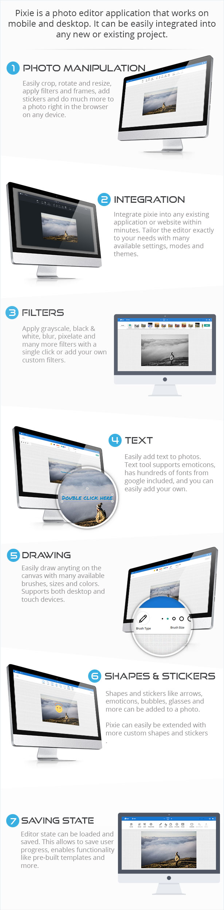

# Pixie
Pixie is a photo editor application that works on mobile and desktop. It can be easily integrated into any new or existing project.


[Live Preview](https://pixie.vebto.com/)



Pixie is fully customizable, highly performant and responsive photo editor for your website or mobile application.

## Features
- Integration – Easily integrate pixie into any existing project or application.
- Extensible – Pixie interface and API can be extended with new functionality.
- Mobile – Pixie has full mobile support and adapts its interface to fit size of any device automatically.
- Customizable UI – Customize UI by showing, hiding or adding new menu items, changing toolbar positions or using a different theme.
- Translatable – Pixie’s interface is fully translatable via configuration.
- Watermark – Saved photos can be easily watermarked with specified text.
- Modes – Choose between overlay(modal), inline or full screen modes.
- Tools API – Use all pixie tools (resize, crop, frame etc) via API without opening pixie interface.
- Customizable Tools – All tools are fully customizable, you can remove or modify and add custom stickers, shapes, fonts, frames and more.
- State – Save current editor state in json format, allowing for functionality like pre-built templates.
- Photo Manipulation – Resize, crop, transform and more via interface or API.
- Filters – Pixie comes with many built in filters like grayscale, blur, black & white, vintage and more. More filters can be added via API..
- Frame – Add built-in responsive frames to photo of any size or add your own frames.
- Crop – Crop photo to one of specified aspect ratios or let user select custom crop zone via UI.
- Draw – Powerful free drawing tool supports both mouse and touch, has multiple brush types, colors and more.
- Text – Full support for adding text to images. Several hundred of google fonts can be used or only custom added fonts.
- Shapes – Custom shapes can be easily added by simply specifying svg image path.
- Stickers – Custom stickers can be added or removed. Any type of image can be used as a sticker.
- Corners – Image corners can be rounded with one simple click or API call.
- Empty canvas – Pixie does not have to edit existing photo, custom images can easily be created from scratch as well.
- History – All editor actions are non destructive and can be easily undone and redone via history tool.
- Objects – All objects like stickers, shapes and text are on their own layer and can be easily moved, resized, deleted and modified by changing their color, adding shadow, background and more.
- Patterns and Gradients – All objects can be filled in with many built in or custom patterns and gradients.
- Saving – Modified image can be easily saved on local device or on the server via API or interface..
- Zoom & Pan – Canvas can be zoomed and panned using mouse, mouse wheel, or touch and pinch gestures on mobile devices.
- HTML5 – Pixie uses native HTML5, which means it works on every device.

## Documentation
Online documentation can be found at our help center [here](https://support.vebto.com/help-center/articles/10/13/50/getting-started).

## License

```
Copyright (c) 2019 LuckyPal IT

Permission is hereby granted, free of charge, to any person obtaining a copy
of this software and associated documentation files (the "Software"), to deal
in the Software without restriction, including without limitation the rights
to use, copy, modify, merge, publish, distribute, sublicense, and/or sell
copies of the Software, and to permit persons to whom the Software is
furnished to do so, subject to the following conditions:

The above copyright notice and this permission notice shall be included in all
copies or substantial portions of the Software.

THE SOFTWARE IS PROVIDED "AS IS", WITHOUT WARRANTY OF ANY KIND, EXPRESS OR
IMPLIED, INCLUDING BUT NOT LIMITED TO THE WARRANTIES OF MERCHANTABILITY,
FITNESS FOR A PARTICULAR PURPOSE AND NONINFRINGEMENT. IN NO EVENT SHALL THE
AUTHORS OR COPYRIGHT HOLDERS BE LIABLE FOR ANY CLAIM, DAMAGES OR OTHER
LIABILITY, WHETHER IN AN ACTION OF CONTRACT, TORT OR OTHERWISE, ARISING FROM,
OUT OF OR IN CONNECTION WITH THE SOFTWARE OR THE USE OR OTHER DEALINGS IN THE
SOFTWARE.
```
